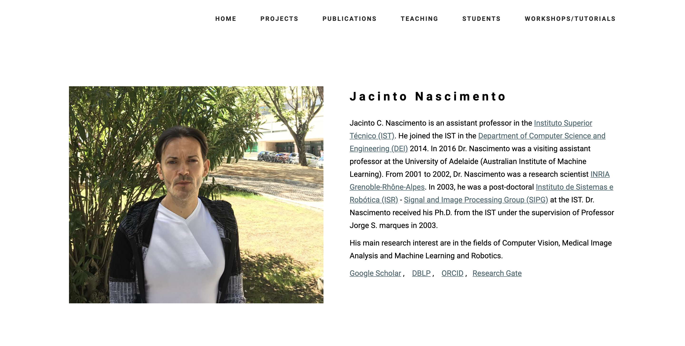

<meta http-equiv="refresh" content="0; url='https://opprDev.github.io/art-jac/src/index.html'" />

# Academic Responsive JAC Page

Based on our early [Academic Responsive Template](https://github.com/opprDev/academic-responsive-template), the presented repository will have the source code for the webpage of Professor Jacinto C. Nascimento. The [Academic Responsive Template](https://github.com/opprDev/academic-responsive-template) is a free [Bootstrap-based theme](https://getbootstrap.com/) for academic purpose. Great for scholars and collegials landing pages, it is 100% mobile-friendly and looks amazing on any device. The template includes a lot of rich features and addons that you can use as a great starting point for your next [Bootstrap 3](https://getbootstrap.com/docs/3.3/) project.
